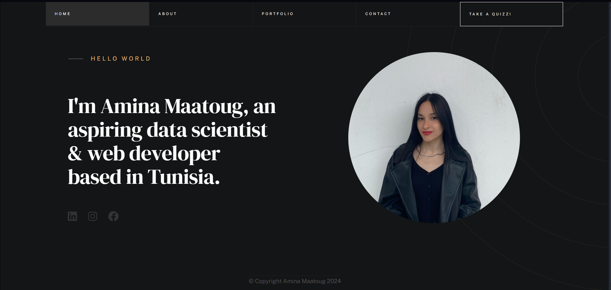

# Amina Maatoug - Personal Portfolio

> A clean, fast, and fully responsive personal portfolio website.
> Started from a free HTML template and heavily customized with my own design, colors, content, animations, and extra features.

# Tech Stack

- HTML5
- CSS3
- Vanilla JavaScript

# Why Vanilla?

I intentionally kept this portfolio without React, Tailwind, Bootstrap, or any other framework to:

- Prove deep understanding of core web technologies
- Load under 1 second even on slow 3G connections

# Project Structure

* [.vscode/](.\DSweb\.vscode)
  * [settings.json](.\DSweb\.vscode\settings.json)
* [css/](.\DSweb\css)
  * [styles.css](.\DSweb\css\styles.css)
* [images/](.\DSweb\images)
  * [icons/](.\DSweb\images\icons)
    * [icon-close.svg](.\DSweb\images\icons\icon-close.svg)
    * [icon-quote.svg](.\DSweb\images\icons\icon-quote.svg)
    * [icon-tag.svg](.\DSweb\images\icons\icon-tag.svg)
  * [portfolio/](.\DSweb\images\portfolio)
    * [design.jpg](.\DSweb\images\portfolio\design.jpg)
    * [ntl_networks.png](.\DSweb\images\portfolio\ntl_networks.png)
    * [nylfinal.png](.\DSweb\images\portfolio\nylfinal.png)
    * [smart_house.jpg](.\DSweb\images\portfolio\smart_house.jpg)
    * [the-bridge.jpg](.\DSweb\images\portfolio\the-bridge.jpg)
    * [theater.jpg](.\DSweb\images\portfolio\theater.jpg)
    * [thebridge.png](.\DSweb\images\portfolio\thebridge.png)
  * [about.jpg](.\DSweb\images\about.jpg)
  * [about2.jpg](.\DSweb\images\about2.jpg)
  * [about3.jpg](.\DSweb\images\about3.jpg)
  * [Android_Studio.png](.\DSweb\images\Android_Studio.png)
  * [bacdiploma.jpg](.\DSweb\images\bacdiploma.jpg)
  * [eclipse.webp](.\DSweb\images\eclipse.webp)
  * [eclipse1.png](.\DSweb\images\eclipse1.png)
  * [Git.png](.\DSweb\images\Git.png)
  * [mindshift.jpg](.\DSweb\images\mindshift.jpg)
  * [mysq1.png](.\DSweb\images\mysq1.png)
  * [mysql.png](.\DSweb\images\mysql.png)
  * [Power-BI.png](.\DSweb\images\Power-BI.png)
  * [power-bi_logo$.png](.\DSweb\images\power-bi_logo$.png)
  * [screenshot.png](.\DSweb\images\screenshot.png)
  * [wheel-1000.jpg](.\DSweb\images\wheel-1000.jpg)
  * [wheel-2000.jpg](.\DSweb\images\wheel-2000.jpg)
  * [wheel-500.jpg](.\DSweb\images\wheel-500.jpg)
  * [WordPress-Logo1.png](.\DSweb\images\WordPress-Logo1.png)
  * [WordPress.png](.\DSweb\images\WordPress.png)
* [js/](.\DSweb\js)
  * [main.js](.\DSweb\js\main.js)
* [pages/](.\DSweb\pages)
  * [about.html](.\DSweb\pages\about.html)
  * [contact.html](.\DSweb\pages\contact.html)
  * [education.html](.\DSweb\pages\education.html)
  * [events.html](.\DSweb\pages\events.html)
  * [internships.html](.\DSweb\pages\internships.html)
  * [projects.html](.\DSweb\pages\projects.html)
  * [quizz.html](.\DSweb\pages\quizz.html)
  * [skills.html](.\DSweb\pages\skills.html)
* [videos/](.\DSweb\videos)
  * [acting.mp4](.\DSweb\videos\acting.mp4)
  * [IEEE.mp4](.\DSweb\videos\IEEE.mp4)
  * [iit.mp4](.\DSweb\videos\iit.mp4)
  * [NYL_networks.mp4](.\DSweb\videos\NYL_networks.mp4)
  * [smarthouse.mp4](.\DSweb\videos\smarthouse.mp4)
* [.hintrc](.\DSweb\.hintrc)
* [index.html](.\DSweb\index.html)
* [README.md](.\DSweb\README.md)
